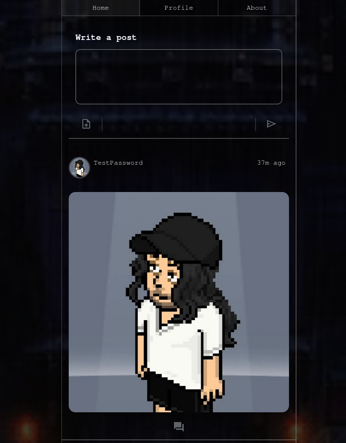

# Microblog Portfolio Project

Welcome to my **Microblog Portfolio Project**! This is a personal project I’m working on in my free time to deepen my knowledge of **Angular 19**, **Terraform**, and **AWS**. The project is currently under development, and I invite you to explore and test it at the following link:  
[microblog-portfolio.asciicrawler.com](http://microblog-portfolio.asciicrawler.com)

Frontend repository:
[https://github.com/AsciiCrawler/microblog-angular](https://github.com/AsciiCrawler/microblog-angular)

Backend repository:
[https://github.com/AsciiCrawler/microblog-terraform](https://github.com/AsciiCrawler/microblog-terraform)

## Key Features
- **User Authentication**: Simple login and registration system with support for profile pictures.
- **Post Creation**: Create and share posts with ease.
- **Comment System**: Engage with other users by commenting on posts.

## Technologies and Services Used
- **Frontend**: Angular 19 with Server-Side Rendering (SSR) for improved performance and SEO.
- **Infrastructure as Code**: Terraform for provisioning and managing cloud resources.
- **Database**: DynamoDB for scalable and efficient data storage.
- **API Management**: API Gateway AWS for handling RESTful APIs.
- **Image Hosting**: CloudFront for fast and reliable image delivery.
- **Backend**: TypeScript-based Node.js Lambdas for serverless backend logic.
- **Security**: AWS Secret Manager for securely managing sensitive information.
- **File Storage**: S3 for handling file uploads and storage.

## Project Status
This project is a work in progress, and I’m continuously adding new features and improvements. Feel free to explore, test, and provide feedback!

---

### Why This Project?
This microblog platform serves as a hands-on learning experience to master modern web development technologies and cloud infrastructure. By combining Angular 19, Terraform, and AWS, I aim to build a scalable, performant, and maintainable application.

### How to Contribute
If you’re interested in contributing or have suggestions, please open an issue or submit a pull request. Your feedback is highly appreciated!

---

**Happy coding!** 🚀

### Preview
